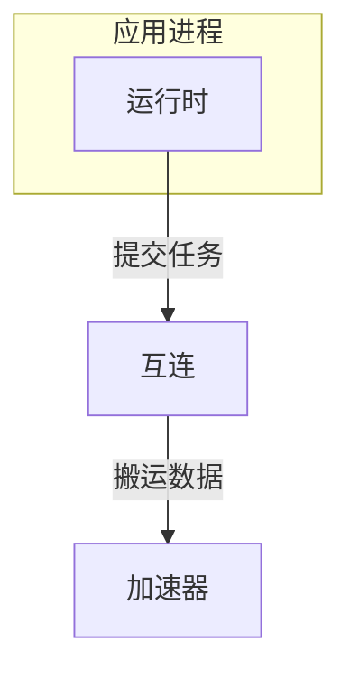
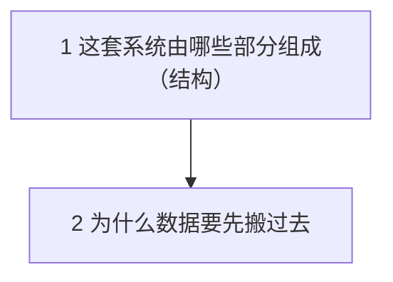

# 示例：先安放部件，再追因果

> 模式：**完整**（每个 unit 预测 → 重建 → 追问）　状态：待确认
> 这门课混用两种节：第 1 节安放部件（结构讲解），第 2 节解释其中一处设计为什么这样做（问题链）。

## 学习目标与材料

- 目标：面对一套陌生的技术框架时，先说得出它由哪些部分组成、谁连谁，再解释其中一处设计为什么这样做。
- 材料：`examples/source.md` 的 Architecture 与 Course ordering 两节；Appendix 不用（与本示例的主线无关）。

## 1. 总体问题

材料里的名词都认识，却说不出它们在系统里的位置，后面比较几条路径时无从下手。

学完之后：能在系统图上指出任意一个部件的位置与职责，并解释其中一条连线为什么存在。

## 2. 系统图

这张图在整门课里始终有效，学习期间随时可以回来看；只有在检查点作答时合上它。

## 3. 问题链

| # | Unit | 组织方式 | 当前问题 → 方案 | 状态 |
|---|---|---|---|---|
| 1 | 这套系统由哪些部分组成 | 结构讲解 | 说不出名词的位置 → 先把部件安放到图上 | 待学 |
| 2 | 为什么数据要先搬过去 | 问题链 | 加速器读不到应用进程的内存 → 计算前后各搬一趟 | 待学 |

第 2 节展开的是系统图上的**互连**；学完回到这张图，其余部件的内部机制仍未展开。

## 4. 全部概念

**第 1 节 这套系统由哪些部分组成**（结构讲解节的部件只作辅助或仅列出，不进主问题）

- 应用进程（supporting）：发起计算的那个进程，持有输入数据。
- 运行时（supporting）：应用进程里的一层库，把计算请求翻译成设备能接受的任务。
- 互连（listed）：连接主机侧与加速器的通道，任务与数据都从这里过。定位：`examples/source.md` 的 Architecture。
- 加速器（listed）：真正执行计算的设备，有自己的内存。定位：`examples/source.md` 的 Architecture。

**第 2 节 为什么数据要先搬过去**

- 跨互连搬运（core）

## 5. 覆盖账本摘要

| 材料 | 去处 |
|---|---|
| `examples/source.md` Architecture | 第 1 节，辅助 |
| `examples/source.md` Course ordering | 第 2 节，核心 |
| `examples/source.md` Appendix | 不用：与本示例的主线无关 |

## 6. 使用说明

- 每节的讲义在 `units/<节 id>.md`（本示例只到大纲为止，不含讲义）。
- 想验收某个 supporting 概念，说"验收 运行时"。
- listed 概念只给了名字和一句定义，想展开就说"细化 互连"。
- 结构图与步骤表学习期间随时可看；检查点作答时合上，按一条路径自己讲一遍。
