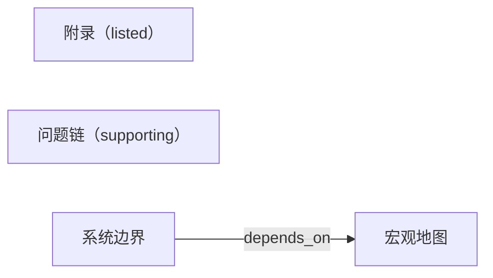

# Unit 1：从线性材料到总体结构

## 当前问题

逐页或逐文件阅读会让局部信息遮住系统要解决的总体问题。

## 两个案例（先看它们，写下共同点，再看方案）

1. 一个只读文件的转换脚本：输入是文件路径，输出是转换结果，中间只有解析与写出（`examples/source.md`，`## Architecture`）。
2. 一条多阶段的数据流水线：输入是原始事件，输出是报表，中间是清洗、聚合、渲染（同上）。

这两个例子表面不同，结构相同：先问它们共同的形状是什么，再往下读。

## 解决方案

先建立输入、关键过程和输出的宏观地图。

## 工作机制

宏观地图把分散内容压缩成少数功能步骤，使后续细节能挂接到明确位置。

## 它引出的新问题

结构只能说明“有什么”，不能说明“为什么必须这样设计”。

## 本节概念

**core**
- **系统边界**：本次解释纳入和排除的输入、过程与输出。最容易与**宏观地图**混淆：边界回答“哪些东西算在内”，地图回答“算在内的东西怎么连”。
- **宏观地图**：为细节提供位置的最小端到端流程。

**supporting**
- **问题链**：把材料重组为“问题 → 方案 → 新问题”的序列。在本节机制里，它是宏观地图之后的第二步——地图给出位置，问题链给出顺序。

**listed**
- **附录**：不进入主线、可按需展开的次要细节（来源 `examples/source.md`，`## Appendix`）。

## 本节概念的关系（可选）

## 来源

- `examples/source.md`，`## Architecture`（`explicit`）：来源直接列出主要步骤。
- 课程先讲总体结构（`pedagogical_inference`）：这是教学顺序，不是来源的事实主张。

## 轮到你解释

为什么直接按文件顺序阅读容易失去整体意义？宏观地图解决了什么，又没有解决什么？
